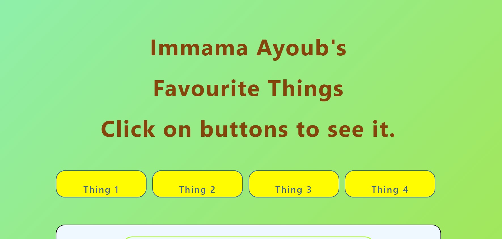

<h1 color="#adff2f" allign="center"> Favourite Thing App </h1>

This mini app will let the user know the author's top secret favourite 🤐 things. Created using JSON as main data, this mini app let user navigate through each data specified by click button handlers. In other words, it means that the user can access each favourite thing and their description by simply clicking on the buttons. Have a look and Enjoy.

 ----> all the detailed documentation, descriptions are provided in the includes folder.

## Prerequisites
 - Have a Git Bash
 - Also GitHub account
 - and Browser to view the web page

## Usage
 - Clone the project
 - cd to your directory/download and
 - open the index.html file in a browser (Terminal on a Mac / Linux, Windows command prompt).

-> Built with Html, SCSS, CSS and JS.

Enjoy!

## Credits
Immama Ayoub (>‿◠)✌

## License
MIT © 2022 Immama Ayoub
